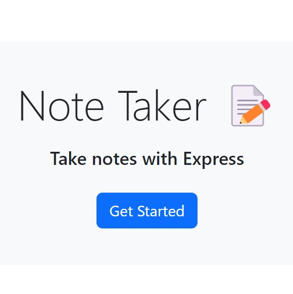

# Profile Generator
  
  ## Description
  This is a simple note-taking application using Node and Express and can be found <a href="https://note-taker12345.herokuapp.com">here</a> 
  
  

  ## Table of Contents
  * <a href="#installation">Installation</a>
  * <a href="#usage">Usage</a>
  * <a href="#license">License</a>
  * <a href="#contributing">Contributing</a>
  * <a href="#tests">Tests</a>
  * <a href="#questions">Questions</a>

  ## Installation
  To install this project, you will need Node installed. From the command line, run "npm i" to ensure you have all the required dependencies. 
  ## Usage
  To use the deployed application, click Get Started on the home page. Once you enter a new note title, a save button will appear and you can save anything you have typed on the screen. To delete a note, click the trash can icon. 
  ## License
  This project is covered under an MIT license. 
  ## Contributing
  If you would like to contribute to this project, please contact me <a href="mailto: lily.langerud@gmail.com">here</a>.
  ## Tests 
  This project does not include any tests at this time.
  ## Questions
  If you have any questions about the project please find me on <a href= "https://github.com/llangerud">GitHub</a> or contact me via email <a href="mailto: lily.langerud@gmail.com">here</a>.

